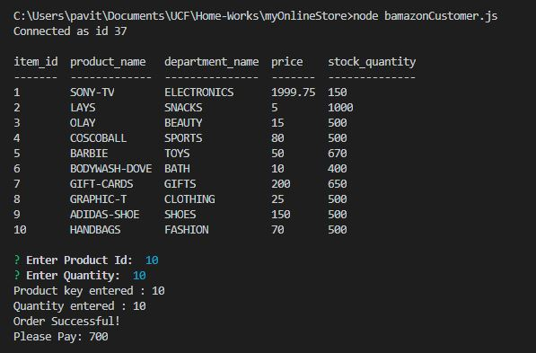
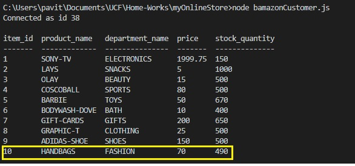

# MySQL

**Concept**  
Creating an Amazon-like storefront app with the MySQL

#"TO-DO"

1. Creating a MySQL Database called `bamazon`.  

2. Then creating table called `products` inside database.

3. Creating table columns called

   * item_id (unique id for each product)

   * product_name (Name of product)

   * department_name

   * price (cost to customer)

   * stock_quantity (how much of the product is available in stores)

4. Populate this database with 10 different products

5. Then creating a Node application called `bamazonCustomer.js`. Running this application will first display all of the items available for sale. Include the ids, names, and prices of products for sale.

6. This app should then prompt users with following messages.

   * "ENTER PRODUCT ID"
   * "ENTER QUANTITY"

7. Once the customer has placed the order, this app should check if your store has enough of the product to meet the customer's request.

   * If not, the app should log a phrase like `Insufficient quantity!`, and then prevent the order from going through.

8. And finally this will update the database too.

9. This is the screenshot of output window of this app 

10. After the update. 

